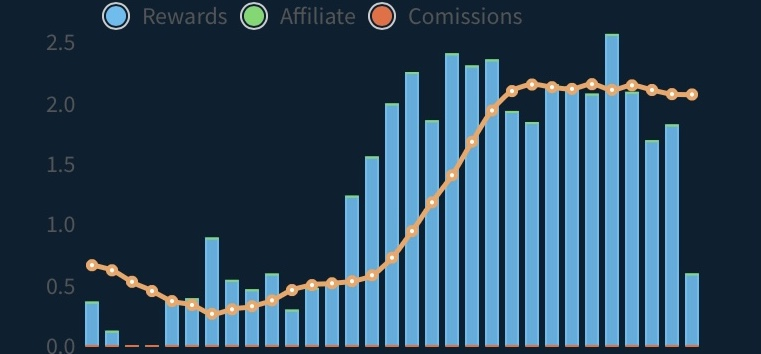

 

# ROI

In order to reduce the length of time it takes you to [return on your investment](../helium-glossary.md#roi), you can optimize your deployment in one of the following ways;

* _**IF** you must_ [_mine_](../helium-glossary.md#mining) _at your house, place your_ [_antenna_](../helium-glossary.md#antenna) _outdoors as high as possible._
* Use [HotspotRF](https://hotspotrf.com/) to determine a location for a [host](../helium-glossary.md#host) or for an [off-grid.](../helium-glossary.md#off-grid)
* **Deploy a SORMN\*-** Single Owned Rural Mining Network; A collection of [hotspots](../helium-glossary.md#hotspot) deployed in a rural area by a single entity, with adequate distance between them to maximize [transmission scale](../helium-glossary.md#transmission-scale). As rewards scaling continues to impact urban mining locations, relocating established off-grids, or deploying new ones for this purpose can yield incredible rewards.

**\*This is the last great frontier of** [**Helium**](../helium-glossary.md#helium) **mining!** Don’t miss the opportunity to establish your own.&#x20;
