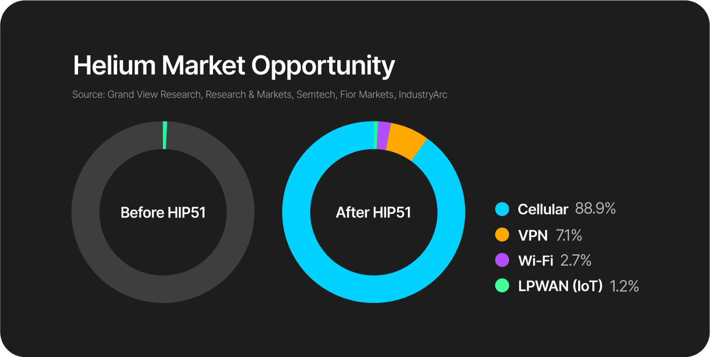

# Demystifying HIP51

 What's with the FUD? This is an incredible opportunity for the future of The People's Network!

### Let's Talk About This Graphic

I'll assume your eyes jumped straight down to [LPWAN ](../helium-glossary.md#lorawan)([IoT](../helium-glossary.md#iot)) 1.2%.

Take another look at that first pie chart and note the size of the LPWAN (IoT) slice, notice they're the same. This pie chart indicates the fact [Helium](../helium-glossary.md#helium), before HIP51, provided a service that only around 1.2% of the global [wireless ](../helium-glossary.md#wireless)market could utilize, which translates to a maximum prospective 1.2% of the yearly global industry budget. By maximizing the wireless capabilities, [Nova ](../helium-glossary.md#nova-nova-labs)and Helium are maximizing utility by accessing the industries full budget. _This is one of the few_ [_services_ ](../helium-glossary.md#service)_that exist in which **everyone on**_ [_**earth**_ ](../helium-glossary.md#earth)_is a potential customer!_

Allowing other [network ](../helium-glossary.md#network)protocols to onboard to Helium provides additional use-case utility to the service provided, thus adding long-term stability to the [token](../helium-glossary.md#native-token). What HIP51 does is provides a platform for other network providers to use the Helium [blockchain ](../helium-glossary.md#blockchain)and [HNT ](../helium-glossary.md#hnt)[reward ](../helium-glossary.md#reward)system to incentivize users with the same bootstrapping strategy that saw Helium undergo absolutely unpresented growth.

Do keep in mind, until it is sold, the HNT in your wallet represents [stock ](../helium-glossary.md#stock)in Helium, which is a tangible [software ](../helium-glossary.md#software)being provided. This technology Nova created is new, and evolving, and like other new industry forerunners, including [crypto ](../helium-glossary.md#crypto)itself, may see many large scale "corrections" while the market tries to figure out what this new entity is. The important fact of the matter, is that by encouraging other providers with the incentivization platform that underpins Helium's success, Nova labs now has companies lining up at their door for the opportunity to be a part of the ubiquitous [decentralized ](../helium-glossary.md#decentralized)wireless revolution.

This sort of opportunity lines the Helium network up for great long-term success. Unfortunately however, there has been a lot of FUD spread around the [Discords](../helium-glossary.md#discord), Reddit, and Youtube about what individual [miners ](../helium-glossary.md#miner)believe this Helium Improvement Proposal means for them. _They are nearly **all** wrong_. Hotspot owners are encouraged to zoom out a bit, and keep the perspective that mining [cryptocurrency ](../helium-glossary.md#cryptocurrency)isn't an income, it's an investment.

Some folks sell every bit of HNT as they make it, some went all in early and HODL. I'm not giving investment advice and will hold my tongue, because there will be an "I told you so" moment in Helium, and it'd be far too skeptical to say it's clear at this point who that will be.

I do however know who I'm betting on\_. Do you?\_

_#LongLive the #ThePeoplesNetwork_
